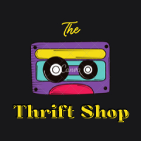

# The Thrift & Share auction site

_Semester Project for 2. year students in Front-End Development,
at Noroff VOC Oslo, Norway. Student: Linda Sandaker, aka frk.Sandkake_
  

 

Table of contents

-   [Project Details:](#Project-details:) 
- -   [Brief:](#Brief:)
  -   [Requirements:](#Requirements:)
  -   [Technical Restrictions:](#technical-restrictions:)
  -   [API Info:](#API-info:)
-   [My Design](#My-design:)
    -   [Inspiration:](#inspiration:)
-   [How to start the project:](#How-to-start-the-project:)
- -   [Resources:](#Resources:)
  -   [More info about `npm` and installed packages:](#More-info-about-npm-and-installed-packages:)
  -   [These helped me:](#Help!!-(different resources that helped me along the way):)

### Project details:

#### Brief:

An auction site is looking to launch a website where the users themselves
can put up items for auction.  Only registered users can list items and make
bids, but unregistered users can see all the auctionen items. New registered
user are given 1000 credits to use on the site. They can get more credits by auctioning of items.
  

#### Requirements:

The project is to build a front-end application that handles the provided API.

**Unregistered user should be able to** view `Listings`, and register with `stud.noroff.no` email.

**Registered users should be able to** log in and log out. Update their avatar. Create a `Listing`, with Title, DeadlineDate, Gallery, and Description. They should also be able to view their total credit, use credit to make a `Bid`, and view `Bids` made on a `Listing`
  

#### Technical restrictions:

*The highlighted ones have been chosen for this project:*

| CSS Framework   | CSS processors | Hosting services | Design Application | Planning Application |
|-----------------|----------------|------------------|--------------------|----------------------|
| Bootstrap (>5)  | SASS/SCSS      | GitHub Pages     | Adobe XD           | Trello               |
| `Tailwind (>3)` | `PostCSS`      | `Netlify`        | `Figma`            | `GitHub Projects`    |**__
| MUI (>5)        |                |                  | Sketch             |                      |

 

#### API Info:

**Documentation:** [Auction house-EndPoints](https://docs.noroff.dev/auctionhouse-endpoints/authentication)  
**Testing:** [API Swagger](https://api.noroff.dev/docs/)

 

### My Design:

The target audience is a younger crowd that likes Thrift shops, both finding unique items and supporting charities.

The color palette for my design comes from the logo underneath. It has a vintage feel with the tape cassette.
The colors, in yellow, purple and cyan, are vibrant and playful. Background colors are dark zinc and light amber and 
hopefully gives the visitors and users a calm and warm impression. 

The logo is self-made with the website title "Thrift&Share" in a gradient from the color palette.

#### Inspiration:

  

Toggle to see links;

[flowbite.com buttons](https://flowbite.com/docs/components/buttons/)  
[daily-dev-tips: Vanilla JS forEach function that calls all Modals](https://daily-dev-tips.com/posts/vanilla-javascript-modal-pop-up/) 
[tailwind CSS responsive design](https://tailwindcss.com/docs/responsive-design) 
[redpixelthemes: tailwindcss gradient text](https://redpixelthemes.com/blog/tailwindcss-gradient-text/) 
[(YouTube) Floating labels with Tailwind](https://www.youtube.com/watch?v=nJzKi6oIvBA) 

 

### How to start the project:

**Fork and/or Clone this repo**

 

Toggle to read more

On GitHub:

- Fork this repo to get your own copy AND/OR
- Copy the code URL or SSH link that you find under `<> Code` button

Locally, on your PC:

- In Terminal
    - `cd .\path\ ` to directory/folder for your local workspace
    - run:`git clone <Github repo URL or SHH>`
    - then `cd .\path\` to new folder with repo name
- Then open your IDE/code editor
    - Open the directory (or folder) with your cloned repo

 

**Command lines to run in terminal:**

| Commands          | Description                                                |
|-------------------|------------------------------------------------------------|
| `npm install`     | Installs all packages in Package.json in the node modules  |
| `npm run build`   | Builds the project into minified version (dist folder)     |
| `npm run preview` | To preview the project in minified mode (from dist folder) |
| `npm run dev`     | To see the whole project                                   |

 

**Other package command lines:**

| Commands           | Description                                                    |
|--------------------|----------------------------------------------------------------|
| `npm run lint`     | Checks for errors and warnings for; Prettier, Babel and ESLint |
| `npm run lint-fix` | Runs Prettier setup, fixes some errors (see more in console)   |                                                               |

 

### Resources:

[GitHub Docs](https://docs.github.com/en) 
[Shield Badges](https://shields.io/)

#### More info about `npm` and installed packages:

Toggle to see links;

[vite JS dev guide](https://vitejs.dev/guide/) 
[tailwind CSS](https://tailwindcss.com/) 
[flowbite docs quickstart](https://flowbite.com/docs/getting-started/quickstart/#require-via-npm) 
[aviyel.com Top 5 reasons why you should use flowbite right now](https://aviyel.com/post/3725/top-5-reasons-why-you-should-use-flowbite-right-now) 
[@babel/eslint-plugin](https://github.com/babel/babel/tree/main/eslint/babel-eslint-plugin)

**Good to know `npm` Command lines:**

| Commands                          | Description                                       |
|-----------------------------------|---------------------------------------------------|
| `npm init -y`                     | Will initiate  a new Node JS project Package.json |
| `npm outdated`                    | To see the outdated packages                      |
| `npm update`                      | Updates the project dependencies                  |
| `npm update <packagename>`        | Updates a specific project dependency             |
| `npm uninstall <package_name>`    | Uninstalls a project dependency                   |
| `npm update -g`                   | Use -g flag for global dependencies               |
| `npm update -D` or `--save-dev`   | Use -d or --dev flag for devDependencies          |
| `npm uninstall -g <package_name>` |                                                   |

 

#### Help!! (different resources that helped me along the way):

[free code camp: 4 reasons your z-index isn't working and how to fix it](https://www.freecodecamp.org/news/4-reasons-your-z-index-isnt-working-and-how-to-fix-it-coder-coder-6bc05f103e6c/)  
[ESlint: Parsing Error Unexpected Token](https://stackoverflow.com/questions/65097114/eslint-error-in-html-file-parsing-error-unexpected-token)    
[npm Uninstall - by Kolade Chris, FreeCodeCamp](https://www.freecodecamp.org/news/npm-uninstall-how-to-remove-a-package/)

(<a href="#top" style="color: powderblue">back to top</a>)

